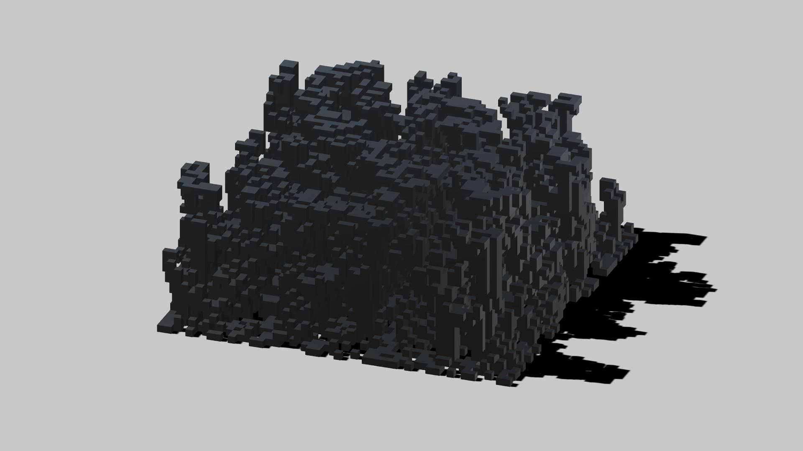

<strong>AADRL | Workshop 2 </strong>

<strong>Tutors:</strong> Mustafa el Sayed, Octavian Gheorghiu

<strong>Description:</strong> Unity code developed during the second workshop at the Architectural Association, DRL, 2017.

<strong>Prerequisite tutorials:</strong>

<ul>
<li>Object Oriented Languages: <a href="https://goo.gl/chcD4L">https://goo.gl/chcD4L</a></li>
<li>C# for Unity: <a href="https://goo.gl/dJsHf6">https://goo.gl/dJsHf6</a></li>
<li>Understanding Unity Scripting: <a href="https://goo.gl/hY1Fft">https://goo.gl/hY1Fft</a></li>
<li>Advanced Unity Scripting: <a href="https://goo.gl/uXct66">https://goo.gl/uXct66</a></li>
</ul>

&nbsp;

<strong>&nbsp;</strong>

&nbsp;

